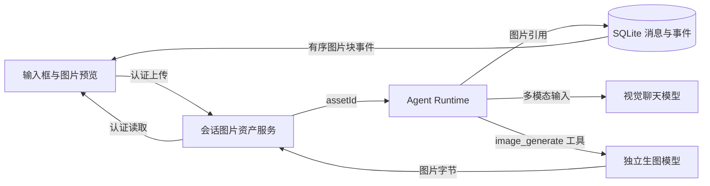

# 会话图片输入与生成设计

## 目标

用户可以在对话中上传图片，请支持视觉输入的聊天模型识别；也可以要求 Agent 生成图片。图片要在当前流和重开的历史会话中直接展示，而不只是显示 URL、JSON 或工具输出。成功标准、失败场景和实施任务见 [OpenSpec 变更](../../../openspec/changes/add-conversation-images/proposal.md)及其 [行为规格](../../../openspec/changes/add-conversation-images/specs/conversation-images/spec.md)。

## 已确认的范围

- 首版：选择/粘贴图片、图片或图文提问、文字生图、对话内显示与保存图片。
- 生图：独立工具，模型连接列表中使用生图能力开关并指定默认模型，先支持 OpenAI Images API 兼容端点；单次工具调用最多并行生成 4 张。
- 存储：图片与附件按会话分别建立目录；消息、任务、事件和图片引用继续由 SQLite 管理。
- 暂不处理：参考图编辑、局部重绘、遮罩和供应商原生生图协议。

## 交互与数据流

新会话创建前的图片暂存于短期目录，任务接受后绑定到该会话的 `uploads` 子目录。生成图片落入同会话的 `generated` 子目录。Runtime 按图片 ID 管理路径和元数据，消息与流事件只保存引用。文本与图片都按请求内序号恢复；缺失文件显示占位，不影响其他内容。

视觉输入继续走现有 OpenAI 兼容 Chat Completions 适配层；适配器在发送前读取图片并构造多模态 content parts。`image_generate` 走独立的 Images API 兼容适配器，一次接受最多 4 条独立提示词并并行请求；每张成功图片完成后即可插入本轮助手消息，部分失败保留成功图片。聊天模型和生图模型可以来自不同已保存连接。现有模型列表提供图片输入和生图能力开关，用户从已打开生图开关的模型中指定唯一默认模型；生图专用连接无需通过聊天模型测试。不增加自动候选筛选或逐个能力探测，开关不保证提供方兼容，实际失败时展示可读错误。

## 方案比较与裁决

推荐方案是“现有聊天编排 + 独立生图工具 + 本地图片资产”。它能复用工具循环、取消和历史恢复，并独立配置生图模型。备选是迁移到 Responses API 内置图片工具，其优势是多轮编辑和部分图片流，但会扩大首版的协议与模型适配迁移。另一个可行但较弱的方案是渲染模型返回的 Markdown 图片链接；它无法保证图片归属、离线回看或生成模型可控。用户确认推荐方案，并限定 Images API 兼容端点；在模型发现方式上裁决为现有列表的能力开关和手动默认选择，并要求最多 4 张图片并行生成。

用户随后明确：仅图片及附件按会话分目录，结构化记录继续使用 SQLite。因此不迁移现有会话数据库。此项补充已纳入 [技术设计](../../../openspec/changes/add-conversation-images/design.md)。

## 风险与验证

图片文件与 SQLite 事务无法跨介质原子提交；文件先落盘、再提交引用，孤立文件可清理，引用丢失文件时显示占位。现有模型网关会记录序列化请求，接入视觉输入前必须把媒体字节从交互日志和 Phoenix trace 排除。手动开关可能指向不兼容端点，首次调用错误需要直接可见；并行生成最多 4 张，可能遇到限流或多笔费用。首版只保证准备、逐张完成、部分失败和终态，不以部分图片预览为验收条件。验证覆盖纯图片提问、图文提问、4 张并行生图、取消、断线重放、历史恢复、目录隔离和旧任务兼容。
