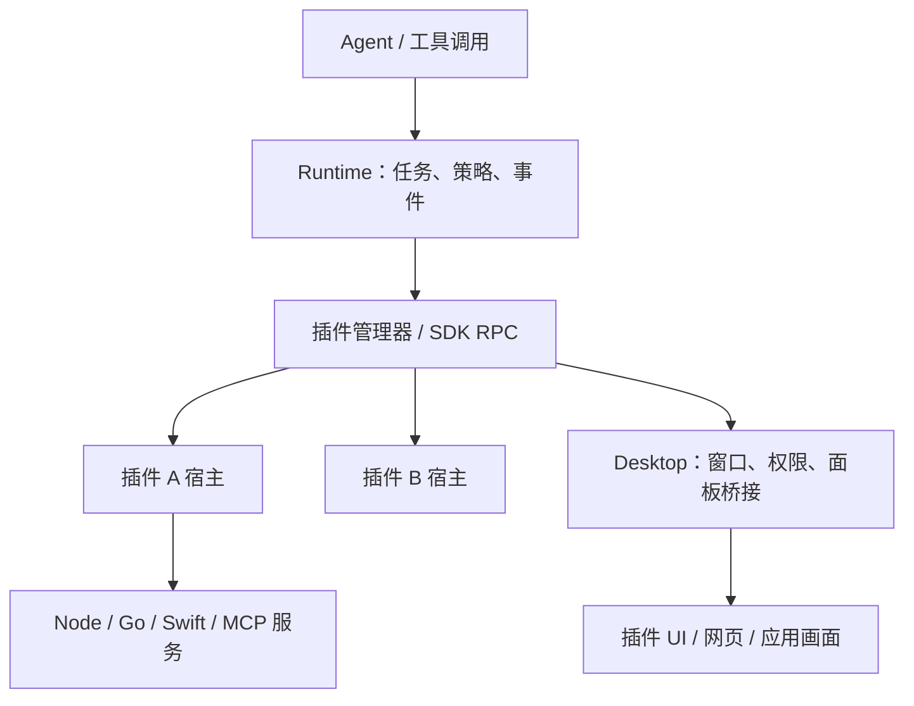
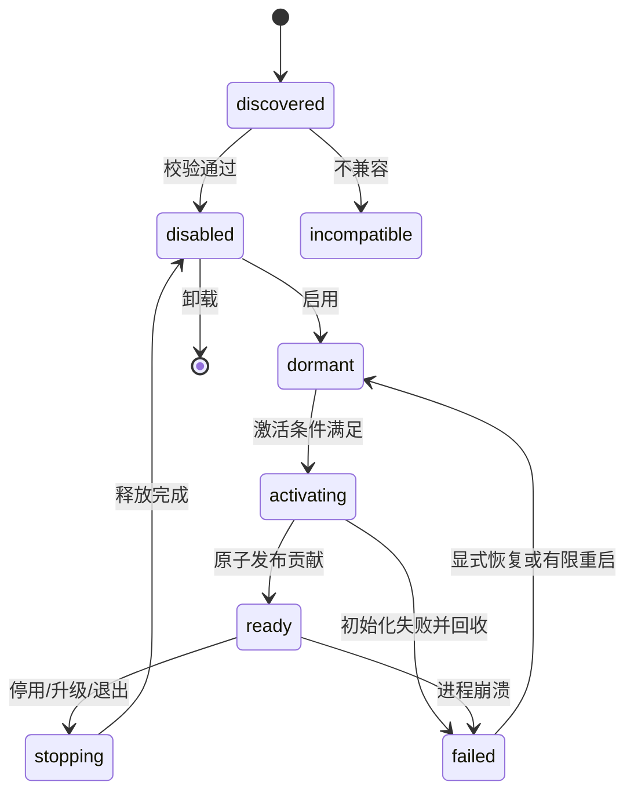

## Context

动机和 Battle 裁决见 [proposal.md](proposal.md)。本设计已获用户确认，按任务清单实施。

当前 `runtime-process.ts` 手工装配脚本、Computer Use、搜索、网页读取和图像工具。ToolRegistry 已支持工具版本与模型名校验，但缺少插件归属及注销。Desktop 的 SkillProviderHost 和 LocalCapabilityClient 已提供注册、调用、取消及本机能力桥接，可以作为兼容适配层。BrowserPanel 当前是占位界面，不能作为已有浏览器插件能力。

Runtime 继续拥有任务、会话、事件、工具调用结果及恢复事实；Desktop 继续拥有窗口、本机权限和资源。现有 SessionSandbox、AppApprovalStore、取消语义和未知副作用恢复规则必须保留。

## Goals / Non-Goals

**Goals:** 为内置与第三方提供同一套版本化扩展 API；允许 Node、Go、Swift 等服务；能力可独立启停、定位故障和打包；平台资源有明确所有者。

**Non-Goals:** 首版不提供插件 OS 沙箱，不引入完整 IDE 框架，不实现云端插件宿主、市场、调度引擎或文档生成业务。可信模式不是删除模型脚本沙箱的理由。

## Decisions

### 1. 小内核与进程外插件宿主

选择在现有 Runtime/Desktop 上增加插件管理器、公共 SDK、RPC bridge 和服务监督。每个活跃插件运行在独立 Node 子进程，原生服务作为受监督子进程；暂停中的插件不常驻。内核保留任务调度、模型调用、持久化、授权、执行沙箱、凭据代理与资源管理。



替代方案是使用 Theia 全平台：已有扩展机制，但会引入 IDE 应用结构与较大迁移成本；仅业务插件化则无法满足工具共用生命周期的要求。选择小内核是渐进迁移建议，具体契约由本设计供用户审查。

进程隔离提供故障归属与回收能力，不提供安全隔离。可信插件可以直接访问用户权限范围内的系统。首版均可信是用户明确裁决，覆盖第三方默认受限的建议。

### 2. Manifest 描述贡献，SDK 执行注册

插件包包含 `plugin.json`、入口及可选 skills、UI、服务和原生产物。Manifest 声明稳定 ID、版本、SDK 兼容范围、平台/架构、激活条件、贡献及所需宿主能力。内置插件使用同一校验和注册路径，不能导入内核内部模块。

贡献标识属于插件命名空间；已有工具稳定 ID 和模型名在迁移中保持兼容。冲突拒绝启用并给出双方归属，不依赖安装顺序覆盖。Skill 与工具插件必须额外导出纯数据贡献目录，包含工具完整 schema 与 Skill 内容/资源引用；外部装配层读取目录后构造模型工具和指令。目录模块与执行模块分离，读取目录不调用 activate、不启动服务、不改变 grants，最终拼接由 Runtime/调用方承担。此细化由用户在实施中明确指定，沿用已批准的声明式贡献边界，无需重新 Battle。

Manifest 用于建立发现索引；激活成功并通过可用性检查后才发布可执行工具。

```ts
export interface PluginModule {
  activate(context: PluginContext): Promise<void> | void;
  deactivate?(reason: StopReason): Promise<void> | void;
}

export interface PluginContext {
  readonly plugin: { id: string; version: string };
  readonly subscriptions: DisposableStore;
  readonly api: ActionDriverAPI;
}
```

这是 SDK 契约草案，不是允许插件访问完整应用对象。所有跨进程接口仅传可序列化 DTO、资源句柄和错误码。大文件/图片用 artifact 引用；连续画面使用专门媒体通道，不能把现有 JPEG 分块协议当作实时流协议。

### 3. 对插件保留的 API

用户追加明确约束：采用依赖注入。沿用当前 composition root 和 ports 模式，不使用全局单例或隐藏的服务定位器。插件入口只接收宿主构造的 PluginContext；其 api 是经过 RPC 包装的接口对象，不是 Runtime 对象。插件内部业务模块通过构造参数接收自己需要的窄接口，不把整个 context 逐层传递。

内核定义 PluginRepository、PluginHostFactory、ProcessSupervisor、CapabilityTransport、PanelHost、CredentialBroker、ArtifactStore、Clock 等 ports。Runtime 和 Desktop 各自在 composition root 绑定本机适配器；单元测试注入显式 fake。PluginManager 不自行启动进程、不读取全局配置或访问具体数据库；这些动作交给注入的 ports。错误时不得自动切换 mock 或另一执行环境。

跨进程 DI 注入的是契约代理和实例绑定，不传递函数或具体类。服务依赖声明可选/必需及兼容范围，宿主激活前解析；缺失必需依赖或循环依赖明确失败。首版不引入通用 DI 容器，使用类型化构造注入和启动期装配，避免反射与全局查找使依赖关系不可见。

| SDK 命名空间 | 首版职责 | 边界 |
| --- | --- | --- |
| `tools.register` | schema、超时、风险、副作用、执行与取消处理器 | 安装或注册不授予 Agent 调用权；调用经 Runtime 策略 |
| `commands.register/execute` | UI 和程序命令、启用条件 | 不直接伪造模型工具调用；跨插件调用经宿主路由 |
| `skills.register` | 指令型 Skill 与资源引用 | Markdown 不成为授权来源 |
| `capabilities.register/invoke` | 本机能力适配与跨插件服务契约 | 绑定调用来源、版本、任务上下文和取消 |
| `services.start/stop` | 启动原生、Node、stdio/HTTP MCP 服务 | 限定声明入口；进程、连接由宿主追踪 |
| `panels.register/open` | 面板、网页内容与画面视图 | 类型化消息；无原始 Electron/IPC/Node 暴露 |
| `sessions.getContext` | 最小任务/会话信息及工作区句柄 | 宿主从持久化任务推导，不信任模型传入路径 |
| `artifacts.create/read` | 产物写入、引用、预览 | 通过宿主管理路径与生命周期 |
| `storage.get/set` | 插件私有持久数据、版本迁移 | 不暴露 Runtime 数据库；卸载是否删数据由显式选项决定 |
| `credentials.request` | 宿主代理凭据或限定用途请求 | 默认不把全局凭据注入插件进程环境 |
| `events.subscribe` | 允许的任务/插件事件 | 只读投影，插件不能写权威任务事件 |
| `logging.write` | 结构化日志与诊断 | 关联插件/版本/调用，脱敏；日志不代替调用结果 |

工具执行上下文由宿主注入 `taskId`、`requestId`、`callId`、deadline、取消信号和工作区句柄。任务外命令没有虚构的 taskId。跨插件调用传播同一上下文并检查目标契约及调用策略，不因源插件可信而自动扩大 Agent grants；限制调用深度并检测循环。

所有注册返回 Disposable，由 subscriptions 统一回收。宿主保存每个资源的 pluginId、version、hostEpoch；旧进程消息不能在重启后重新注册资源。SDK 兼容性不通过 TypeScript 类型单独保证：握手校验协议和版本范围，拒绝不兼容包。

替代方案是让插件直接导入 Runtime 服务：开发快但升级和远端部署难以兼容，且卸载不可追踪，因此不采用。

### 4. 生命周期与版本固定



安装先校验临时包，再原子发布版本目录。启用与激活分离；同一插件激活 single-flight，注册先进入临时集合，全部成功才发布，失败回滚全部贡献。激活不得执行用户业务动作。

停用先停止接收新调用，再等待在途调用；期限到后取消并回收进程。取消请求不直接代表业务动作已停止。进程崩溃或强制终止时，对可能产生副作用且无结果的调用记录结果未知，不自动重放。

每次调用固定插件版本和 hostEpoch。升级先卸载旧贡献并完成在途处理，再启用新版本；首版不让两个版本同时争抢同一工具。保留旧包可回退代码；数据迁移要求声明版本、备份与恢复策略，但不得宣称代码回退能撤销外部副作用。无恢复策略的不可逆数据迁移停止升级并报告。

插件退出回收：工具/命令/能力注册、事件订阅、面板、RPC 连接、服务进程及租约。资源回收由宿主兜底，不依赖 deactivate 一定成功。崩溃重启有次数与退避上限，仅恢复服务，不重放业务调用。

### 5. 可信服务与 MCP

Node 服务使用应用捆绑运行时；Go/Swift 使用包内平台产物，无需用户安装编译器。按 OS/arch 选择二进制并校验可执行入口；缺失明确 unavailable。首版验收以现有 macOS 支持平台为准，不承诺未验证的跨平台原生能力。

stdio MCP 的 stdout 仅传协议，stderr 进入插件日志；HTTP MCP 通过连接配置和凭据代理连接。MCP 工具映射为带来源、版本及 schema 的 Runtime 工具，逐工具应用现有 grants。连接断开使工具不可用，正在执行的副作用按未知结果规则处理。

进程桥接令牌限定插件实例与宿主 API，避免把全局 Runtime 令牌广播给所有进程；这只能约束宿主通道，不能阻止可信代码直接调用 OS。未来受限模式需要不同执行环境和权限强制机制，不能只增加 manifest 权限字段。

模型生成的 shell、Python、JS/REPL 仍使用现有 SessionSandbox。Command 插件调用宿主执行服务；Computer 插件调用保留应用批准和控制门的能力适配器。可信插件可以有意绕过这些边界，这属于可信模式接受的风险，不是平台提供的安全保证。

### 6. 渲染与屏幕扩展边界

Desktop 提供 PanelHost，插件声明面板并通过类型化 bridge 交换 DTO；远程网页不能获得插件宿主权限。网页视图保留 Electron 安全配置和导航策略。应用画面通过资源句柄和媒体通道展示，输入控制作为独立能力经既有授权执行；看到画面不隐含控制授权。

首版提供面板契约及简单面板验收，不在本变更实现通用屏幕共享、音视频协议或完整浏览器驱动。Browser Use 后续通过能力适配器接入 Playwright 与 Electron，不向所有插件暴露裸 CDP 或 Electron 对象。

### 7. 目录及能力归属

```text
packages/plugin-contracts/        # DTO、manifest、协议和错误
packages/plugin-sdk/              # 公共 API、客户端和类型
apps/agent-runtime/src/plugins/   # 管理器、进程宿主入口、注册事务
apps/desktop/src/main/plugins/    # 本机桥接、PanelHost、服务监督适配
plugins/
  search/                        # SearxNG 工具与配置
  command/                       # 执行工具定义，调用宿主沙箱
  web-reader/                    # 网页读取/提取 worker
  computer-use/                  # CUA facade、Skill、UI/native 适配
  browser-use/                   # 后续驱动接入边界
  image-generation/              # 图像工具与提供商适配
```

单插件目录使用 `plugin.json`、`src/`、可选 `skills/`、`ui/`、`services/`、`native/`。构建产物放独立构建目录，安装包使用 `bin/<os>-<arch>/`；源码目录不混入下载工具与构建结果。已有 `thridparty` fork 和工具/构建目录布局由独立任务管理，本设计不重排。

用户安装版本放应用数据目录的 `plugins/installed/<id>/<version>`，私有数据放 `plugins/data/<id>`。内置包随应用分发，和用户包走同一 SDK；包来源影响分发方式，不赋予私有 API。

| 当前归属 | 迁移目标 | 保留内核 |
| --- | --- | --- |
| `searxng` | search 插件 | 工具策略和调用事件 |
| `execution/tools.ts` | command 插件 | SessionSandbox、工作区解析、进程执行机制 |
| `web-open` | web-reader 插件 | 任务、产物引用 |
| `computer-use` 及 native helper | computer-use 插件 | 系统权限代理、应用批准、控制租约 |
| `media` 生成适配器 | image-generation 插件 | 产物存储与凭据代理 |
| BrowserPanel 占位 | browser-use 面板贡献 | Desktop 视图资源管理 |

Skill 加载器、模型网关、检查点、数据库、依赖运行时定位和通用资源管理不是业务能力实现，不强行移为业务插件。复制的 CUA 代码保留来源、许可证与分发审查，不能因移入 plugins 就认定开源。原生 helper 迁移必须保留签名身份与权限行为，并更新打包定位。

## Risks / Trade-offs

- [所有插件具有用户级系统能力] → 安装清楚显示可信模式与来源；用户明确选择首版风险。后续受限模式另行 Battle。
- [逐插件进程增加启动和内存成本] → 按需激活、空闲回收；以真实资源测量调整，不先设计进程共享例外。
- [迁移破坏工具标识、事件或权限] → 固定现有 ID、兼容适配，先做契约回归后移文件。
- [native 路径改变影响签名、TCC 和打包] → 单独阶段迁移并验证打包安装路径；未验证前保留原构建入口。
- [插件面板或网页桥接扩大权限] → 消息白名单、来源/实例校验、无 Node 暴露，网页与服务身份分离。
- [跨插件调用绕过模型策略] → 宿主路由、传播来源与取消、逐目标检查 grants。
- [升级回退不能撤销外部动作] → 未知结果不重放，明确数据恢复策略。
- [其他线程正在改相同模块] → 实施前核对 change 和 git 状态，不覆盖或提交其他线程文件。

## Migration Plan

1. 完成契约与宿主原型，用 fixture 插件证明贡献原子注册、取消、崩溃回收和版本冲突。
2. 迁移 search 作为首个内置插件；保持旧工具调用行为，通过后取消其手工装配。
3. 迁移 command 与 web-reader，验证模型脚本沙箱、取消和产物；再迁移图像生成。
4. 接入 Desktop capability 兼容适配和面板；迁移 Computer Use，保持应用批准与签名 helper。
5. 建立 Browser Use 插件贡献边界；真实驱动由 fork 基线任务完成后单独接入，不在此伪造工具可用性。
6. 验证本机打包、升级/停用/卸载和数据保留；删除已迁移的手工注册分支。每种能力只能有一个活跃注册者。

按阶段保留旧装配 adapter 作为配置级回退，在同一次启动中只选一种路径。回退保留工具 ID 和数据事实，不同时注册两套实现。失败服务恢复不重放任务动作。

参考：[VS Code Extension Host](https://code.visualstudio.com/api/advanced-topics/extension-host)、[Remote Extensions](https://code.visualstudio.com/api/advanced-topics/remote-extensions)、[Web Extensions](https://code.visualstudio.com/api/extension-guides/web-extensions)。借鉴扩展宿主、声明式贡献和 activate/deactivate，不直接采用 VS Code 的全部 API。

### 8. npm SDK 与插件开发脚手架

用户已明确裁决：Skill 与执行层必须在同一个插件包内，模块分离不表示分开分发。公共 `@actiondriver/plugin-sdk` 提供版本化 API、类型与上下文客户端，npm 构建产物包含 JavaScript 与声明文件，依赖链不得要求第三方导入仓库内部代码。`@actiondriver/plugin-contracts` 提供可序列化 DTO 与校验。

`create-actiondriver-plugin` 提供 `npm create actiondriver-plugin` 入口；接受插件名与目标目录，生成 package.json、plugin.json、skills/、src/catalog.ts、src/extension.ts、src/execution.ts、测试与构建配置。catalog 独立暴露完整工具 schema 与 Skill 内容；extension 只完成 activate/deactivate 注册；execution 接收窄接口。开发命令支持 build、test 和 package，最终包带完整 Skill 资源。模板不自行启动宿主、修改 grants 或创建全局服务定位器。

替代方案是 Yeoman generator，与 VS Code 的开发入口一致，但引入通用生成器运行时。推荐并由用户选择独立 npm create CLI，减少依赖，保持产物协议与统一宿主生命周期。首版只生成 TypeScript 模板；原生/MCP 使用已批准 manifest/service 扩展，不生成编译器或假驱动。

验收：生成项目能通过 npm SDK 打包产物构建，目录读取不激活；生成插件可由真实独立宿主加载、执行并停用回收。CLI 拒绝覆盖非空目录，失败不留下半套项目。npm 发布由后续显式发布动作处理。

## Implementation Notes

- Skill 目录与运行入口同包。Runtime 的 PluginInstructionHost 负责资源归集，AgentFileStore 从实时贡献列表读取；停用后删除发布并清除 loaded-skill 状态，旧 system-skills Computer 副本不再作为生产入口。
- Desktop 声明式面板使用专用隔离 preload 和实际 webContents/main-frame 身份，消息经过本机绑定、认证 HTTP 和 Runtime schema 校验后交给 SDK panel handler。查看事件没有任务或控制 grants。
- 安装包重启后恢复发现，外部包默认停用；首版没有安装管理 UI。公开 composition API 提供 install/enable/disable/upgrade/uninstall，npm 包尚未向 registry 发布。
- 生命周期退出先等待有界 deactivate，再回收账本。崩溃清理与重新启用串行，异步服务握手遇到旧实例拒绝会回滚并关闭服务。unknown 终态在模型上下文保留“不自动重试、先核查副作用”的恢复提示。
- 开发及打包使用说明见 docs/plugin-development.md。Computer helper 源码归属 plugins/computer-use/native，原签名身份与安装 Helpers 路径保留。
